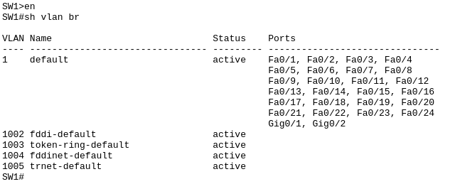
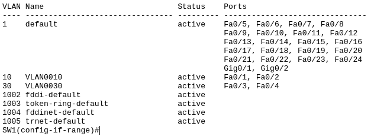
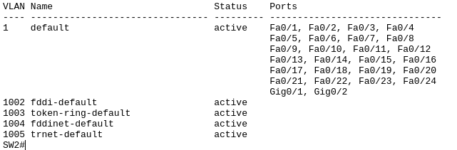
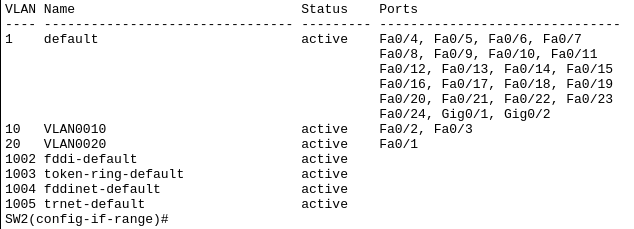
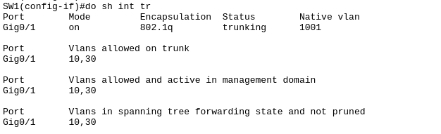
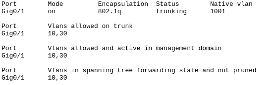
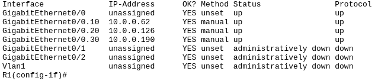
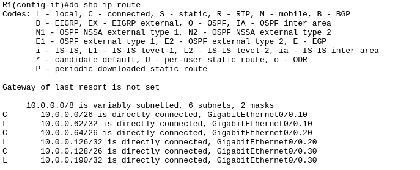

# Inter-VLAN Routing

## Introduction
Implementing Inter-VLAN routing in the given packet tracer file.

## Topology


## Step 1 - VLAN Mapping

On switch 1 (SW1) check the VLAN configuration.

`enable`

`show vlan brief`



Switch 1 (SW1) show only default VLANs are present.

Start mapping ports to VLANs:

```
interface range fa0/1- 2
switchport mode access
switchport access vlan 10
interface range fa0/3- 4
switchport mode access
switchport access vlan 30
```

Check the VLAN configuration again:

`show vlan brief` or `do show vlan brief` if you are in config mode



Switch 1 (SW1) now has VLANs 10 and 30 configured.

Time to configure switch 2 (SW2).

## Step 1.2 - VLAN Mapping

On switch 2 (SW2) check the VLAN configuration.

`enable`

`show vlan brief`



Switch 2 (SW2) show only default VLANs are present.

Start mapping ports to VLANs:

```
interface range fa0/1
switchport mode access
switchport access vlan 20
interface range fa0/2 - 3
switchport mode access
switchport access vlan 10
```

Check the VLAN configuration again:

`show vlan brief` or `do show vlan brief` if you are in config mode



Switch 2 (SW2) now has VLANs 10 and 20 configured.

## Step 2 - Trunking

On switch 1 (SW1) configure trunking:

```
interface g0/1
switchport mode trunk
switchport trunk allowed vlan 10,30
```

It is also a good practice to assign untagged traffics to unused VLAN.

`switchport trunk native vlan 1001`

Check the trunk configuration:

`show interface trunk` or `do show interface trunk` if you are in config mode



Switch 1 (SW1) now has trunking configured.

On switch 2 (SW2) configure trunking:

```
interface g0/1
switchport mode trunk
switchport trunk allowed vlan 10,30
switchport trunk native vlan 1001
```

VLAN 30 does not exist on switch 2 (SW2) and needs to be created.

`vlan 30`

Check the trunk configuration:

`show interface trunk` or `do show interface trunk` if you are in config mode



Switch 2 (SW2) now has trunking configured.

## Step 3 - Inter-VLAN Routing

To enable inter-VLAN routing on switch 2 (SW2):

```
interface g0/2
switchport mode trunk
switchport trunk allowed vlan 10,20,30
```

On Router 1 (R1) issue the following commands to enable inter-VLAN routing:

```
enable
configure terminal
int g0/0.10
ip add 10.0.0.62 255.255.255.192
encapsulation dot1Q 10
int g0/0.20
ip add 10.0.0.126 255.255.255.192
encapsulation dot1Q 20
int g0/0.30
ip add 10.0.0.190 255.255.255.192
encapsulation dot1Q 30
int g0/0
no shutdown
```

To check the subinterface configuration:

`show ip interface brief`



To check the routing configuration:

`show ip route`



___

*Credits to [Jeremy's IT Lab](https://www.jeremysitlab.com/) for the packet tracer file.*
