# EtherChannel
It is a technology that allows multiple physical links to be combined into a single logical link, providing increased bandwidth and redundancy. Other names for EtherChannel include Port Channel and Link Aggregation Group.

In this repository, we will explore the concept of EtherChannel and its implementation on Cisco IOS.

---

## Topology

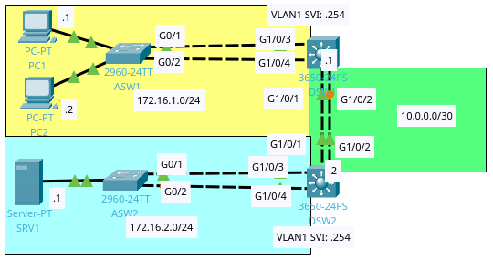

---

## Implementation

---

### Access Switch 1 (ASW1) Configuration

Check the status of the EtherChannel interfaces and verify the configuration.

On ASW1, issue the following command on privilege exec mode.

```
show etherchannel summary
```

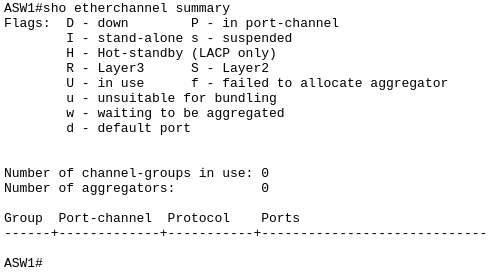

There are no EtherChannel interfaces configured on ASW1.

In global configuration mode, configure the EtherChannel interfaces using Link Aggregation Control Protocol (LACP).

```
interface range GigabitEthernet0/1-2
channel-group 1 mode active
```

The Link Aggregation Control Protocol (LACP) is a protocol used to establish and maintain link aggregation groups (LAGs) between network devices. It is a standard protocol (IEEE 802.3ad) that is supported by most modern network devices, including Cisco IOS.

Make the newly configured EtherChannel as a trunk link.

```
interface port-channel 1
switchport mode trunk
```

Check the status of the EtherChannel interfaces and verify the configuration.

On ASW1, issue the following command on privilege exec mode.

```
show etherchannel summary
```

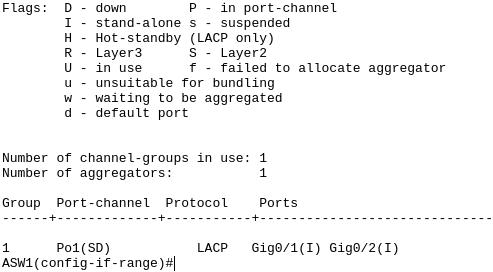

The EtherChannel is down which is expected as the other end is not configured.

The last step is to configure the load balancing mode.

```
interface port-channel 1
load-balance src-dst-ip
```

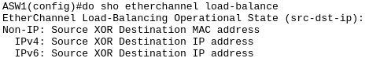

---

### Access Switch 2 (ASW2) Configuration

In global configuration mode, configure the EtherChannel interfaces using Port Aggregation Protocol (PAgP).

```
interface range GigabitEthernet0/1-2
channel-group 1 mode desirable
```

The Port Aggregation Protocol (PAgP) is cisco proprietary protocol developed by Cisco.

Make the newly configured EtherChannel as a trunk link.

```
interface port-channel 1
switchport mode trunk
```

Check the status of the EtherChannel interfaces and verify the configuration.

On ASW2, issue the following command on privilege exec mode.

```
show etherchannel summary
```

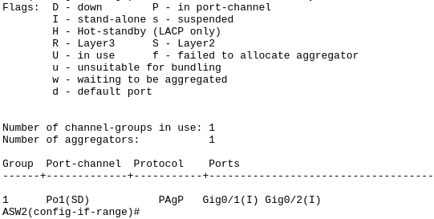

There is one EtherChannel interface configured on ASW2 and same with ASW1 it is down.

Last but not least, configure the load balancing mode.

```
interface port-channel 1
load-balance src-dst-ip
```

---

### Distribution Switch 1 (DSW1) Configuration

Same with the access switches start by checking if there are EtherChannel interfaces.

```
show etherchannel summary
```

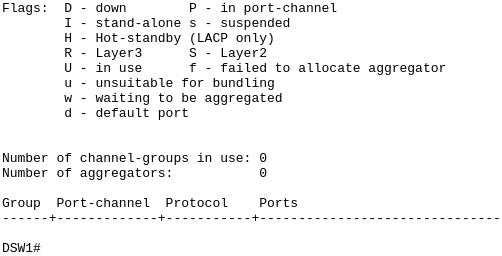

If there are none proceed with the configuration.

```
interface range GigabitEthernet1/0/3-4
channel-group 1 mode active
```

Since the other end is configured with trunk mode. It is necessary to match switchport mode.

```
interface port-channel 1
switchport mode trunk
```

Next will be the EtherChannel between the distribution switches. Use static EtherChannel configuration with the following command.

```
interface range GigabitEthernet1/0/1-2
channel-group 2 mode on
```

Use the newly configured EtherChannel as a routed port.

```
interface port-channel 2
no switchport
ip address 10.0.0.1 255.255.255.252
```

On global configuration mode, change the EtherChannel load-balancing mode.

```
port-channel load-balance src-dst-ip
```

Check the status of the EtherChannel interfaces and verify the configuration.

On DSW1, issue the following command on privilege exec mode.

```
show etherchannel summary
```

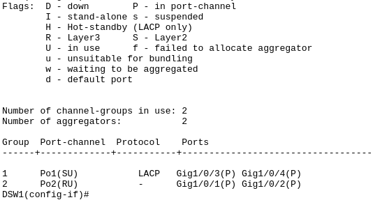

---

### Distribution Switch 2 (DSW2) Configuration

Same with the access switches start by checking if there are EtherChannel interfaces.

```
show etherchannel summary
```

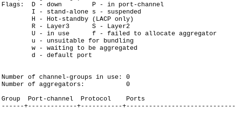

If there are none proceed with the configuration.

```
interface range GigabitEthernet1/0/3-4
channel-group 1 mode active
```

Since the other end is configured with trunk mode. It is necessary to match switchport mode.

```
interface port-channel 1
switchport mode trunk
```

Next will be the EtherChannel between the distribution switches. Use static EtherChannel configuration with the following command.

```
interface range GigabitEthernet1/0/1-2
channel-group 2 mode on
```

Use the newly configured EtherChannel as a routed port.

```
interface port-channel 2
no switchport
ip address 10.0.0.2 255.255.255.252
```

On global configuration mode, change the EtherChannel load-balancing mode.

```
port-channel load-balance src-dst-ip
```

Check the status of the EtherChannel interfaces and verify the configuration.

On DSW2, issue the following command on privilege exec mode.

```
show etherchannel summary
```

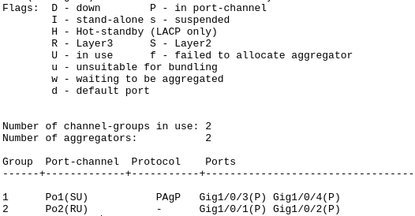

---

## Network Routing

On the distribution switches. Check if Layer 3 routing is enabled.

```
show ip route
```

Distribution Switch 1 (DSW1)

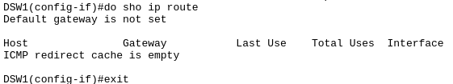

Distribution Switch 2 (DSW2)

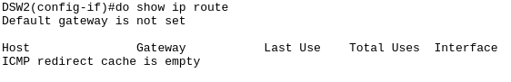

To enable routing on the distribution switches, use the following command on both devices:

```
ip routing
```

Add a new static route on DSW1.

```
ip route 172.16.2.0 255.255.255.252 10.0.0.2
```

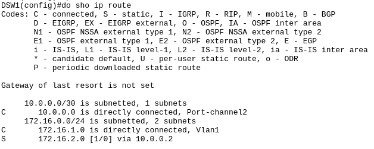

Add a new static route on DSW2.

```
ip route 172.16.1.0 255.255.255.252 10.0.0.1
```

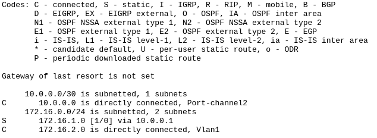

---

## Conclusion

In this lab, we have configured EtherChannel between the distribution switches and enabled Layer 3 routing on the switches. We have also added static routes to enable communication between the VLANs.

And with that both PCs can communicate with the server.

---

*Credits to [Jeremy's IT Lab](https://www.jeremysitlab.com/) for the packet tracer file.*
