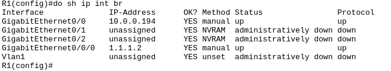

# Inter-VLAN Routing with Layer 3 Switching

## Introduction

This guide will walk you through the process of setting up Inter-VLAN routing using a Layer 3 switch.

## Topology


## Configuration

Let's start by configuring the Layer 3 switch by checking the current configuration and making necessary changes.

```
enable
show running-config
```


The interface GigabitEthernet1/0/2 which is connected to the router is configured in trunk mode.

To restore the default configuration, use the following command:

```
default interface GigabitEthernet1/0/2
```

Next is to enable network routing on the switch:

```
ip routing
```

Following that, we configure the interface GigabitEthernet1/0/2:

```
int g1/0/2
no switchport
ip add 10.0.0.193 255.255.255.252
```

Add a default route to the router:

```
ip route 0.0.0.0 0.0.0.0 10.0.0.194
```


## Switched Virtual Interface (SVI) Routing

Layer 3 switches can also be used to route traffic between VLANs. This is achieved by creating a Switched Virtual Interface (SVI) for each VLAN.

To create an SVI for VLAN 10, use the following command:

```
int vlan 10
ip add 10.0.0.62 255.255.255.192
```

To create an SVI for VLAN 20, use the following command:

```
int vlan 20
ip add 10.0.0.126 255.255.255.192
```

To create an SVI for VLAN 30, use the following command:

```
int vlan 30
ip add 10.0.0.190 255.255.255.192
```


Virtual Interface (SVI) are now added to the switch routing table.

## Router Configuration

Check the router configuration:

```
enable
show running-config
```


Our router show that there are subinterfaces configured for VLANs 10, 20, and 30.

To remove the subinterfaces, use the following commands:

```
no int g0/0.10
no int g0/0.20
no int g0/0.30
```

Restore the default configuration interface GigabitEthernet0/0:

```
default int g0/0
```

Finally, configure the interface GigabitEthernet0/0:

```
int g0/0
ip add 10.0.0.194 255.255.255.252
```

Check the interface status:

```
show ip int brief
```



## Summary

In this lab, we learned how to configure a Layer 3 switch to route traffic between VLANs using Switched Virtual Interfaces (SVIs). We also learned how to configure a router to route traffic between VLANs using subinterfaces.

---

*Credits to [Jeremy's IT Lab](https://www.jeremysitlab.com/) for the packet tracer file.*
